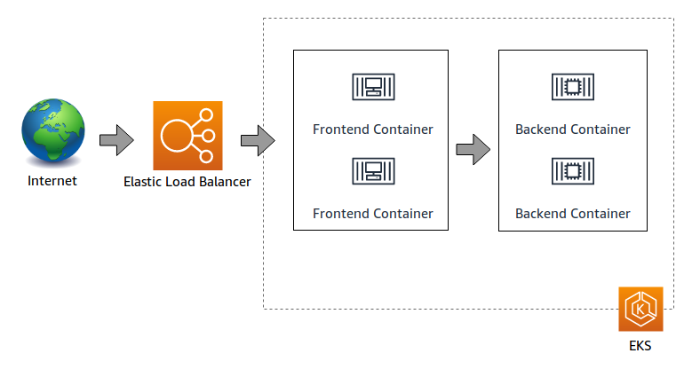
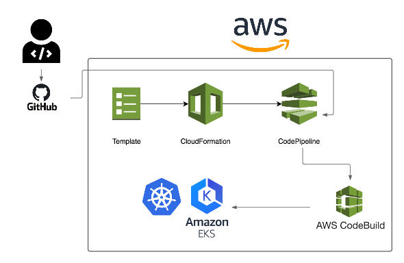

# CI/CD WITH CODEPIPELINE AND EKS

Continuous integration (CI) and continuous delivery (CD) are essential in the world of microservices. Teams are more productive when they can make discrete changes frequently, release those changes programmatically and deliver updates without disruption. This simple web app with 2 microservices architecture follows the recommendations on [The Twelve Factors app methodology](https://12factor.net/) and can be easily applied in a production environment with just a few staging adaptations.



This CI/CD pipeline using AWS CodePipeline and EKS. The CI/CD pipeline will deploy a tier two Kubernetes service, after making a change to the GitHub repository a new image will be built and the deployment object will be patched rolling out a new version of the application in the Kubernetes cluster running on EKS.



## Deploying the pipeline

I assume you already have an EKS cluster up and running, so we will start by creating the IAM role in order to allow AWS CodeBuild to deploy a sample Kubernetes service using [IAM roles for service accounts](https://docs.aws.amazon.com/eks/latest/userguide/iam-roles-for-service-accounts.html). 

### Create the role: 
From the bastion host that allows you to kubectl against your EKS cluster, perform the commands below to create IAM role and policies for CodeBuild:
```
cd ~/environment

TRUST="{ \"Version\": \"2012-10-17\", \"Statement\": [ { \"Effect\": \"Allow\", \"Principal\": { \"AWS\": \"arn:aws:iam::${ACCOUNT_ID}:root\" }, \"Action\": \"sts:AssumeRole\" } ] }"

echo '{ "Version": "2012-10-17", "Statement": [ { "Effect": "Allow", "Action": "eks:Describe*", "Resource": "*" } ] }' > /tmp/iam-role-policy

aws iam create-role --role-name EksWorkshopCodeBuildKubectlRole --assume-role-policy-document "$TRUST" --output text --query 'Role.Arn'

aws iam put-role-policy --role-name EksWorkshopCodeBuildKubectlRole --policy-name eks-describe --policy-document file:///tmp/iam-role-policy
```
## Deploying the pipeline
